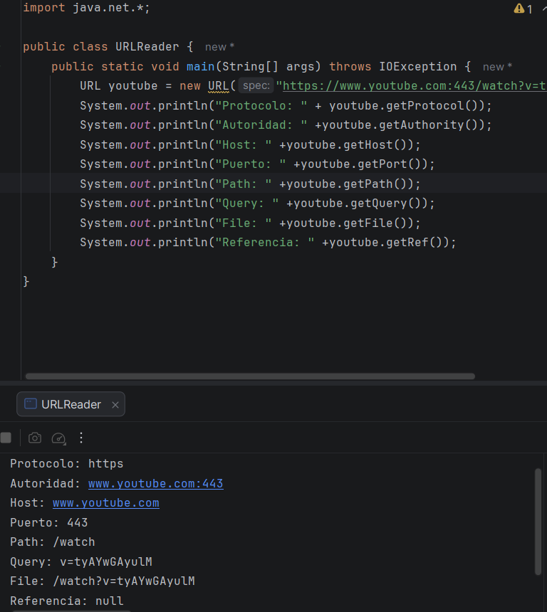
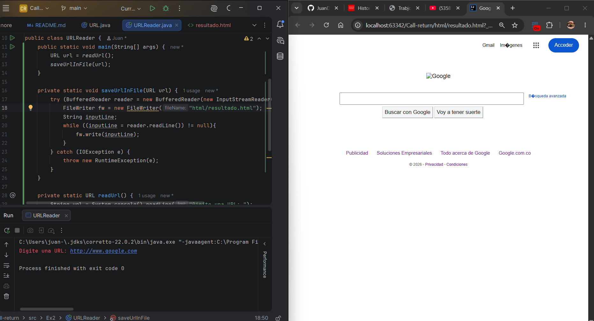
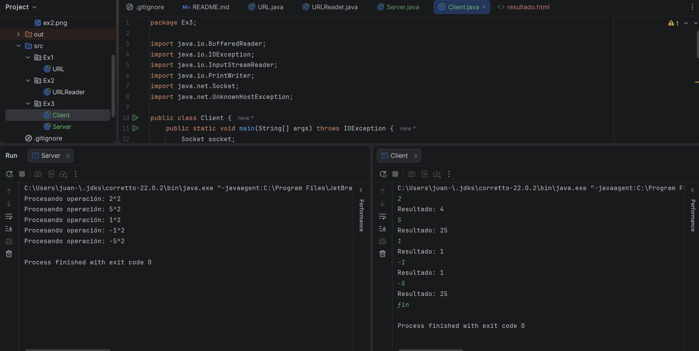
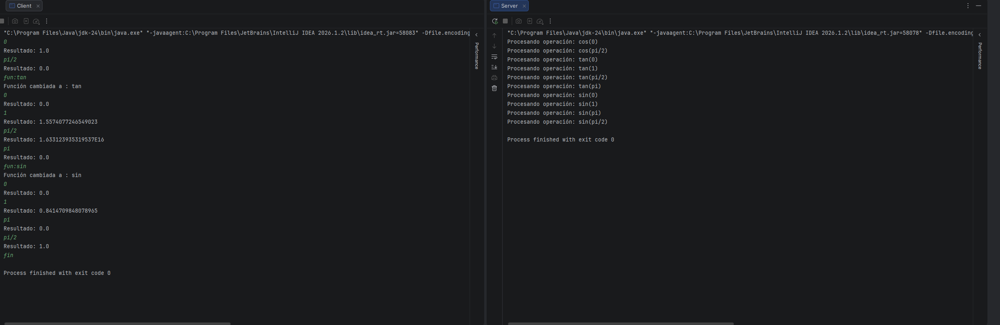
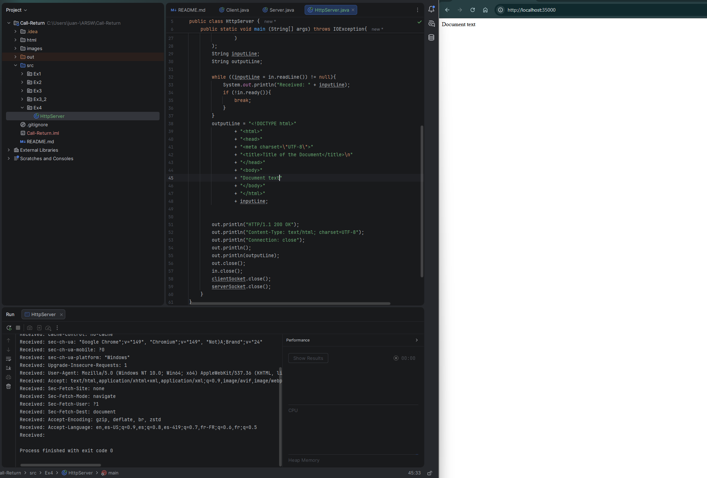
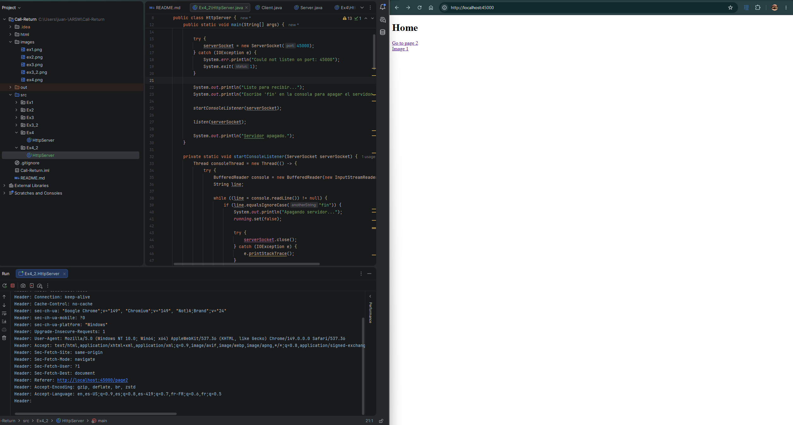
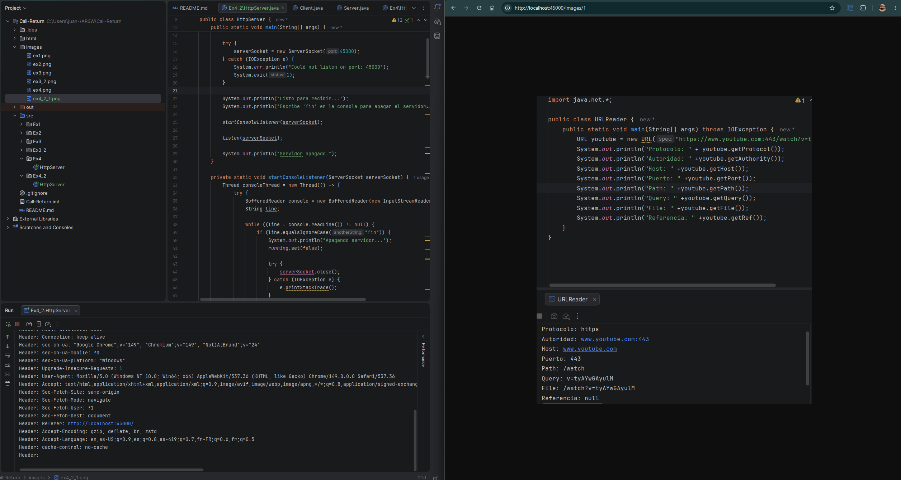
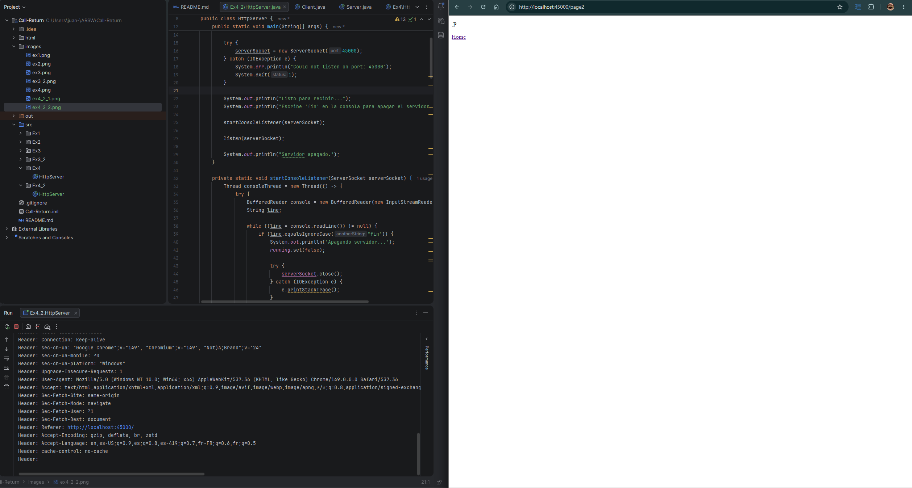
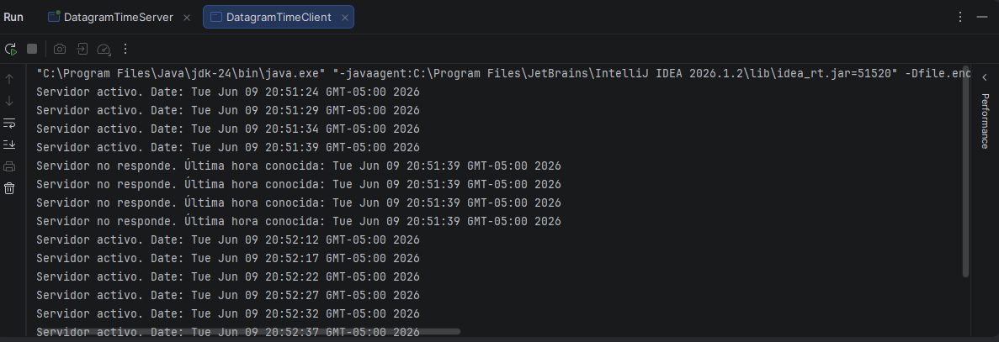
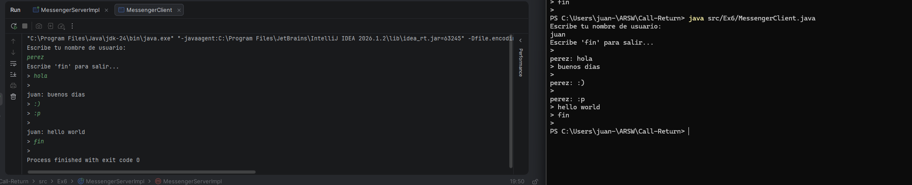

# ARSW Laboratory 3 - Call/Return

## Description

This laboratory is about different ways to communicate programs in Java.  
In the exercises we worked with sockets, HTTP servers, UDP communication and RMI.

The main idea was to understand how a client and a server can send and receive information using different technologies.

## Technologies

- Java
- TCP Sockets
- UDP Sockets
- Basic HTTP Server
- Java RMI
- IntelliJ IDEA

## Exercises

### Exercise 1

In this exercise, we started working with basic communication concepts and reading information.

### Exercise 2

In this exercise, we implemented a basic client-server communication.

### Exercise 3

In this exercise, we used sockets to send and receive data between a client and a server.

### Exercise 4

In this exercise, we created a simple HTTP server using Java sockets.  
The server receives a request from the browser and sends an HTTP response with HTML content.

### Exercise 5

In this exercise, we implemented a UDP time server and client.  
The client asks the server for the current time, and if the server is not available, it keeps showing the last received time.

### Exercise 6

In this exercise, we worked with Java RMI.  
The idea was to create a small messenger system where clients can communicate through a remote server.

## How to run

To run the project, open it in IntelliJ IDEA and execute the main class of each exercise.

For the client-server exercises, the server should be executed first.  
After that, the client can be executed.

For the RMI exercise, the RMI server should be started before running the clients.

## Conclusions

With this laboratory, I learned different ways to communicate Java programs.  
TCP sockets are useful when we need a direct connection, UDP can be used to send datagrams, HTTP can be built using sockets, and RMI allows calling methods from another Java program remotely.

## Author

Juan David Roa Hernández